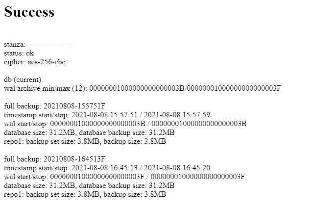
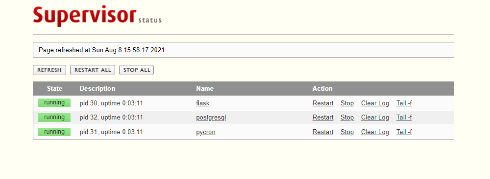

# Backup and Restore- Postgres DB

Custom docker image of a postgres db to enable continuous backup and restore of database.<br/>
To achieve the following we have used the following:
* [pgBackRest](https://pgbackrest.org/): For continuous backup and restore of the database
* Python: To run a cron job of creating regular backups and a flask server to manager the pgBackRest backups
* [Supervisor](http://supervisord.org/): Monitor and control python and postgres db. 

###Version
* Postgres : 12.8-1

### Volumes:
* postgres : /var/lib/postgresql/data
* backup : /var/lib/pgbackrest

### Configuration file:
* backup : data/pgbackrest.conf
* postgres: data/postgresql.conf
* supervisor: data/supervisord.conf

### Exposed endpoint:
* Flask Endpoint : _http://localhost:5000_
* Supervisor dashboard: _http://localhost:9001_

### Environment variables:
* 

## Api's Exposed for managing pgBackRest:

### GetPgBackRestInfo
<a id="opIdgetPgBackRestInfo"></a>

> Code samples
```http
GET http://localhost:5000/pgBackRest/info HTTP/1.1
Host: localhost:5000
```
`GET /pgBackRest/info`

*Get info about the status of pgBackRest*<br/>
Here is how the response looks like

|  |
| ------ |

Explanation:<br/>
The 'backup/expire running' message will appear beside the 'status' information if one of those commands is currently running on the host.

The backups are displayed oldest to newest. The oldest backup will always be a full backup (indicated by an F at the end of the label) but the newest backup can be full, differential (ends with D), or incremental (ends with I).

The 'timestamp start/stop' defines the time period when the backup ran. The 'timestamp stop' can be used to determine the backup to use when performing Point-In-Time Recovery. More information about Point-In-Time Recovery can be found in the Point-In-Time Recovery section.

The 'wal start/stop' defines the WAL range that is required to make the database consistent when restoring. The backup command will ensure that this WAL range is in the archive before completing.

The 'database size' is the full uncompressed size of the database while 'database backup size' is the amount of data in the database to actually back up (these will be the same for full backups).

The 'repo' indicates in which repository this backup resides. The 'backup set size' includes all the files from this backup and any referenced backups in the repository that are required to restore the database from this backup while 'backup size' includes only the files in this backup (these will also be the same for full backups). Repository sizes reflect compressed file sizes if compression is enabled in pgBackRest or the filesystem.

<h3 id="getPgBackRestInfo-parameters">Parameters</h3>
NA

> Example responses

> 200 Response

```html
<html>
<head></head>
<body>
<h1> Success </h1> <br/>
---logs----<br/>
</body>
</html>
```

<h3 id="getPgBackRestInfo-responses">Responses</h3>

|Status|Meaning|Description|Schema|
|---|---|---|---|
|200|[OK](https://tools.ietf.org/html/rfc7231#section-6.3.1)|Info about pgBackRest|HTML page|
|500|[Internal Server Error](https://tools.ietf.org/html/rfc7231#section-6.6.1)|Exception in server side|HTML page|


<aside class="success">
This operation does not require authentication
</aside>

### DoDiffBackup
<a id="opIdDoDiffBackup"></a>

> Code samples
```http
GET http://localhost:5000/pgBackRest/backup/diff HTTP/1.1
Host: localhost:5000
```
`GET /pgBackRest/backup/diff`

*Perform a differential backup of the database. Copies only those database cluster files that have changed since the last full backup. pgBackRest restores a differential backup by copying all of the files in the chosen differential backup and the appropriate unchanged files from the previous full backup. The advantage of a differential backup is that it requires less disk space than a full backup, however, the differential backup and the full backup must both be valid to restore the differential backup.*
<h3 id="doDiffBackup-parameters">Parameters</h3>

NA

> Example responses

> 200 Response

```html
<html>
<head></head>
<body>
<h1> Success </h1> <br/>
---logs----<br/>
</body>
</html>
```

<h3 id="doDiffBackup-responses">Responses</h3>

|Status|Meaning|Description|Schema|
|---|---|---|---|
|200|[OK](https://tools.ietf.org/html/rfc7231#section-6.3.1)|Logs after performing a full backup|HTML page|
|500|[Internal Server Error](https://tools.ietf.org/html/rfc7231#section-6.6.1)|Exception in server side|HTML page|

<aside class="success">
This operation does not require authentication
</aside>

### DoFullBackup
<a id="opIdDoFullBackup"></a>

> Code samples
```http
GET http://localhost:5000/pgBackRest/backup/full HTTP/1.1
Host: localhost:5000
```
`GET /pgBackRest/backup/full`

*Perform a full backup of the database. Copies the entire contents of the database cluster to the backup. The first backup of the database cluster is always a Full Backup. pgBackRest is always able to restore a full backup directly. The full backup does not depend on any files outside of the full backup for consistency.*
<h3 id="doFullBackup-parameters">Parameters</h3>

NA

> Example responses

> 200 Response

```html
<html>
<head></head>
<body>
<h1> Success </h1> <br/>
---logs----<br/>
</body>
</html>
```

<h3 id="doFullBackup-responses">Responses</h3>

|Status|Meaning|Description|Schema|
|---|---|---|---|
|200|[OK](https://tools.ietf.org/html/rfc7231#section-6.3.1)|Logs after performing a full backup|HTML page|
|500|[Internal Server Error](https://tools.ietf.org/html/rfc7231#section-6.6.1)|Exception in server side|HTML page|

<aside class="success">
This operation does not require authentication
</aside>

### DoIncrBackup
<a id="opIdDoIncrBackup"></a>

> Code samples
```http
GET http://localhost:5000/pgBackRest/backup/incr HTTP/1.1
Host: localhost:5000
```
`GET /pgBackRest/backup/incr`

*Perform an incremental backup of the database. copies only those database cluster files that have changed since the last backup (which can be another incremental backup, a differential backup, or a full backup). As an incremental backup only includes those files changed since the prior backup, they are generally much smaller than full or differential backups. As with the differential backup, the incremental backup depends on other backups to be valid to restore the incremental backup. Since the incremental backup includes only those files since the last backup, all prior incremental backups back to the prior differential, the prior differential backup, and the prior full backup must all be valid to perform a restore of the incremental backup. If no differential backup exists then all prior incremental backups back to the prior full backup, which must exist, and the full backup itself must be valid to restore the incremental backup.*
<h3 id="doIncrBackup-parameters">Parameters</h3>

NA

> Example responses

> 200 Response

```html
<html>
<head></head>
<body>
<h1> Success </h1> <br/>
---logs----<br/>
</body>
</html>
```

<h3 id="doIncrBackup-responses">Responses</h3>

|Status|Meaning|Description|Schema|
|---|---|---|---|
|200|[OK](https://tools.ietf.org/html/rfc7231#section-6.3.1)|Logs after performing a full backup|HTML page|
|500|[Internal Server Error](https://tools.ietf.org/html/rfc7231#section-6.6.1)|Exception in server side|HTML page|

<aside class="success">
This operation does not require authentication
</aside>

### DoBackupRestore
<a id="opIdDoBackupRestore"></a>

> Code samples
```http
GET http://localhost:5000/pgBackRest/restore/delta HTTP/1.1
Host: localhost:5000
```
`GET /pgBackRest/restore/delta`

*Restore to latest backup using the delta option. The delta option allows pgBackRest to automatically determine which files in the database cluster directory can be preserved and which ones need to be restored from the backup — it also removes files not present in the backup manifest so it will dispose of divergent changes. This is accomplished by calculating a SHA-1 cryptographic hash for each file in the database cluster directory. If the SHA-1 hash does not match the hash stored in the backup then that file will be restored. This operation is very efficient when combined with the process-max option.*
<h3 id="doBackupRestore-parameters">Parameters</h3>

NA

> Example responses

> 200 Response

```html
<html>
<head></head>
<body>
<h1> Success </h1> <br/>
---logs----<br/>
</body>
</html>
```

<h3 id="doBackupRestore-responses">Responses</h3>

|Status|Meaning|Description|Schema|
|---|---|---|---|
|200|[OK](https://tools.ietf.org/html/rfc7231#section-6.3.1)|Logs from restoring backup|HTML page|
|500|[Internal Server Error](https://tools.ietf.org/html/rfc7231#section-6.6.1)|Exception in server side|HTML page|

<aside class="success">
This operation does not require authentication
</aside>

### DoBackupForDb
<a id="opIdDoDiffBackup"></a>

> Code samples
```http
GET http://localhost:5000/pgBackRest/backup/diff HTTP/1.1
Host: localhost:5000
```
`GET /pgBackRest/backup/diff`

*Perform a differential backup of the database. Copies only those database cluster files that have changed since the last full backup. pgBackRest restores a differential backup by copying all of the files in the chosen differential backup and the appropriate unchanged files from the previous full backup. The advantage of a differential backup is that it requires less disk space than a full backup, however, the differential backup and the full backup must both be valid to restore the differential backup.*
<h3 id="doDiffBackup-parameters">Parameters</h3>

|Name|In|Type|Required|Description|
|---|---|---|---|---|
||||||
> Example responses

> 200 Response

```html
<html>
<head></head>
<body>
<h1> Success </h1> <br/>
---logs----<br/>
</body>
</html>
```

<h3 id="doDiffBackup-responses">Responses</h3>

|Status|Meaning|Description|Schema|
|---|---|---|---|
|200|[OK](https://tools.ietf.org/html/rfc7231#section-6.3.1)|Logs after performing a full backup|HTML page|
|500|[Internal Server Error](https://tools.ietf.org/html/rfc7231#section-6.6.1)|Exception in server side|HTML page|

<aside class="success">
This operation does not require authentication
</aside>

### Supervisor Dashboard:
|  |
| ------ |
This dashboard can be used to 
* Start or stop the services
* View/Clear logs

###Python file
* BackupCron.py - Setup cron trigger for automated backup's
* BackupFlask.py - Flask server to expose api's for working with pgbackrest

